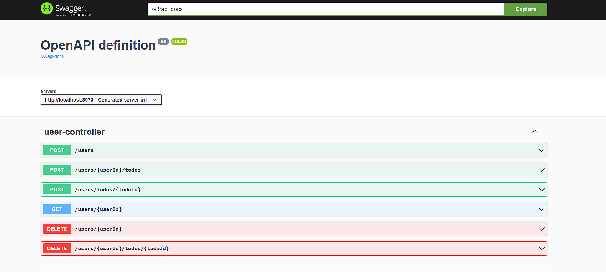
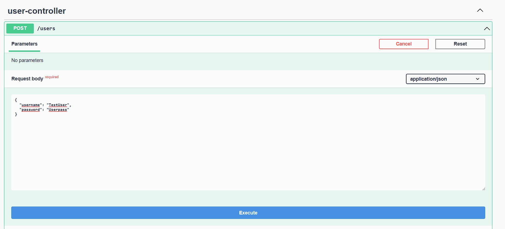
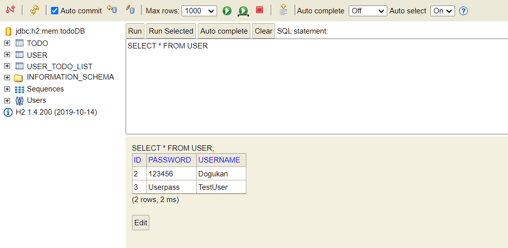
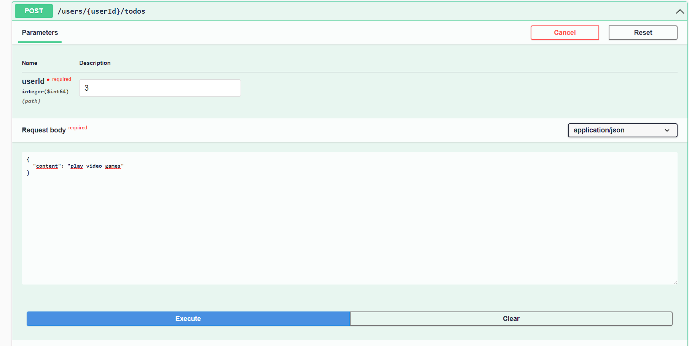
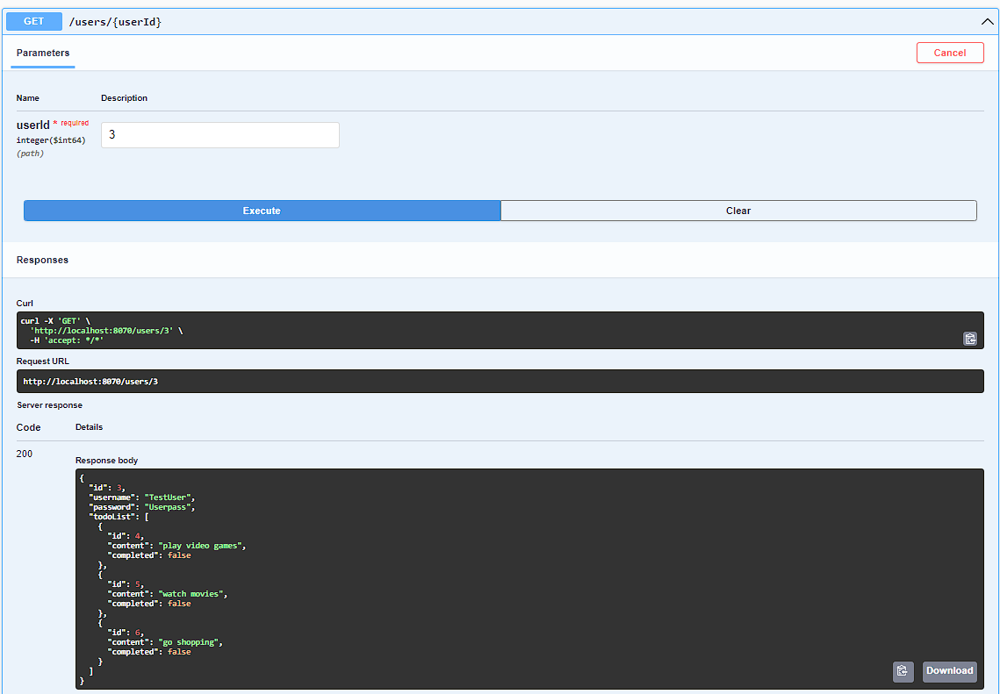
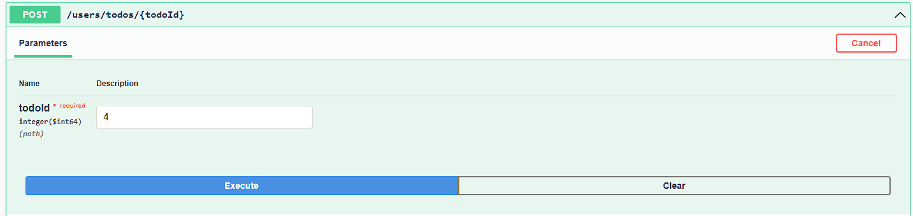
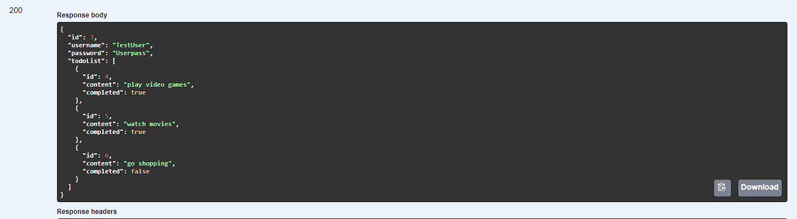
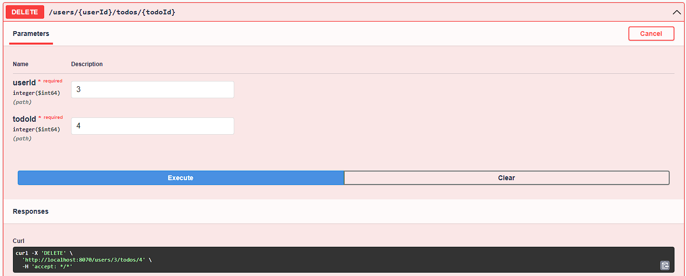
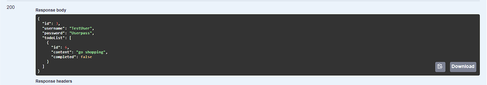

#Todolist  

**TODO List **

It's a todo list project for appcent interview. In this project you can create a user and you can add your own daily job.
When you finish your daily job, you can update your todo list or you can remove it from your list. It's written using the Spring Boot framework.  
Todo list project runs at **8070** port.

**Technology Stack:  **
Java 8 
Spring Boot 2.6.0 
Spring Data 
Maven  
Swagger 
JUnit 
H2 Database 

 
 

**User Endpoints**  

  

As you can see this is the way how to create a user.  

  

Now we can see in h2 console, we create a "Test User" successfully. Also TestUser has a unique ID number which is 3. When we want to add daily job to the list, we
need that id number.  

  

With userID we can add daily job. 

  

We see the users todo list. When we use the "usedID" we can check the todo list.

  

User can change the status when they finish their job.
  

Also we can update todo list. As you can see, The user has finished some of his daily tasks.  

  

Also they can delete some of them.  

  

As you can see, finished jobs are gone.

  

